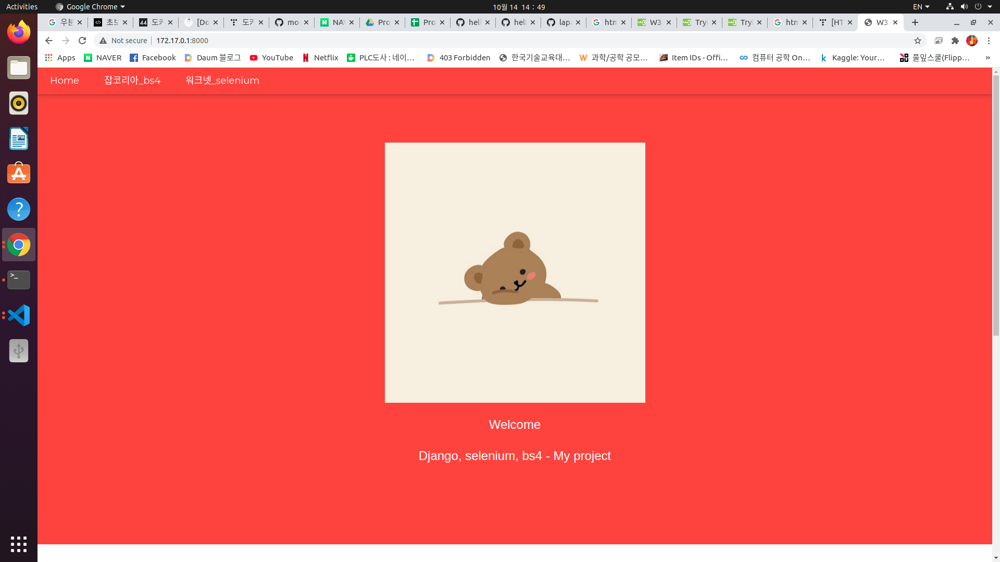
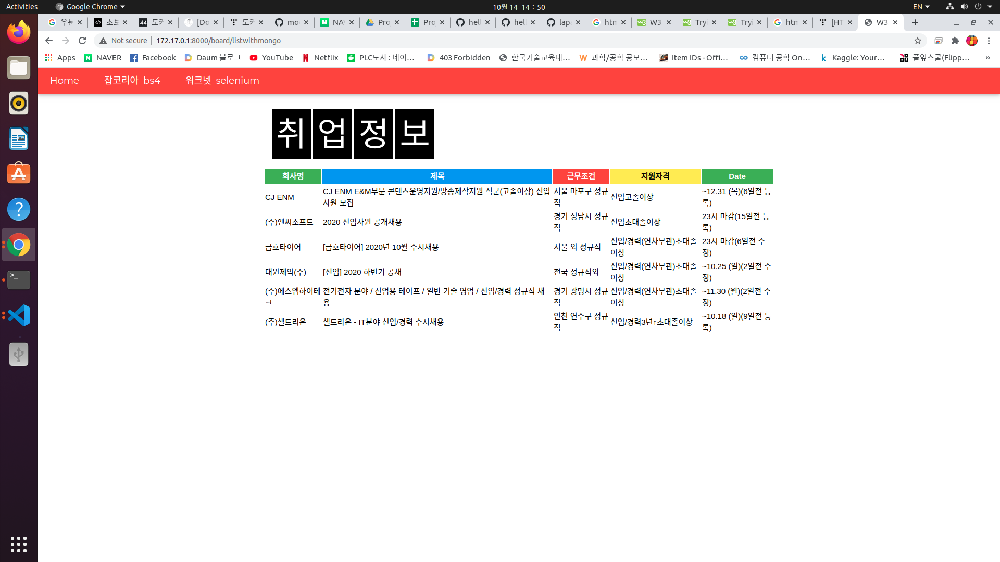

# New_Develop
■ 작성자, 동기 또는 목적 
작성자 : 황문섭, 웹스크래핑,셀레니움 훈련  
■ 적용 기술과 사용법 
셀레니움만으로 스크래핑 구현 

 

./datas/seleniumscraping.py 셀레니움방식  
./datas/scrapjng.py soup 방식 
 
 
■ 간략 화면 설명 
홈 화면  
 
 
넣어준 데이터 값  
 
